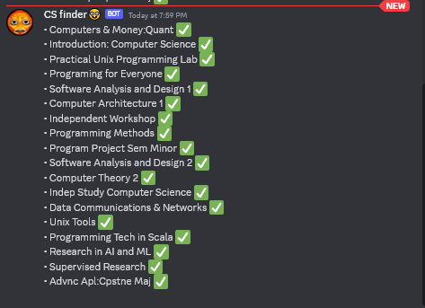

# HunterCollegeClassFinder
Finds which classes are available for whatever major, for now building for Computer science classes will change later on to support all classes


Scrapes CUNY class finder website https://globalsearch.cuny.edu/CFGlobalSearchTool/CFSearchToolController

## Cool things
- Can be tweaked to monitor any CUNY curriculum classes, sends to webhook on discord of all available classes 
- Project also scrapes everything about classes such as time, date, professor, class number and much more
- Uses cheerio to parse html data since CUNY sends HTML from the api to be displayed
- Also implemented fetching new cookie every time one expires

## Future plan?
Using a cron job to automate and schedule task so it checks for available classes also sends to webhook on my discord whenever new class is added so im thinking of old scraped data of classes available and having it compared and only sending to webhook new ones

## Why this project?
Basically everyone I know is struggling to find the classes they want and the spots fill up extremely fast and no one wants to sit there refreshing all day waiting for open CS class to open up so I thought to set up program that reads CUNY API for any changes of classes that become available and it would send an alert on discord notifying me to go and snag the spot! I learned so much.

## What I learned?
On this project on how to navigate around cookie sessions and generating new ones, reading API promises, and parsing HTML data, and also how to integrate discord webhooks for alerts.


## How to use?
Create .env in the directory and add this
```plaintext
WEBHOOK=YOUR_DISCORD_WEBHOOK
```
and replace `YOUR_DISCORD_WEBHOOK` with your actual discord webhook

then run discordWebhook.js 

which should send you discord notification looking like this
(ignore the pfp of the webhook 😭)
